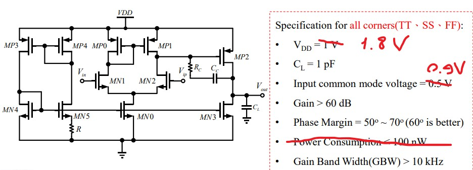

# Sky130 Opamp Practice

This repository contains practice materials for designing and simulating operational amplifiers (opamps) using the Skywater 130nm (Sky130) process with **xschem** and **magic** tools.

## Getting Started

### Topology


### How to Use

1. **Clone the repository**  
   First, clone the repository to your local machine:
   ```bash
   git clone https://github.com/gilangfajrul/sky130_gff_opamp-practice.git
   ```

2. **Navigate to the xschem directory**  
   Change into the `xschem/` directory:
   ```bash
   cd xschem/
   ```

3. **Open the schematic**  
   Open the `op_tb.sch` schematic in xschem:
   ```bash
   xschem op_tb.sch
   ```

4. **Edit the symbols**  
   Click on the symbol you want to edit, then press `e` to open the symbol editor.

5. **Create the layout**  
   Layout your schematic using **magic** tools in the `mag/` directory:
   ```bash
   magic -d XR
   ```

### Additional Tools

There are additional scripts and tools that can help with transistor analysis and netlisting:

1. **Copy the `transistor_modes.py` script**  
   Copy the `transistor_modes.py` file into your netlist directory (usually located at `~/.xschem/simulations/`).

2. **Run the script**  
   Use Python to run the script with your `.lis` file:
   ```bash
   python3 transistor_modes.py op5_tb.lis
   ```
